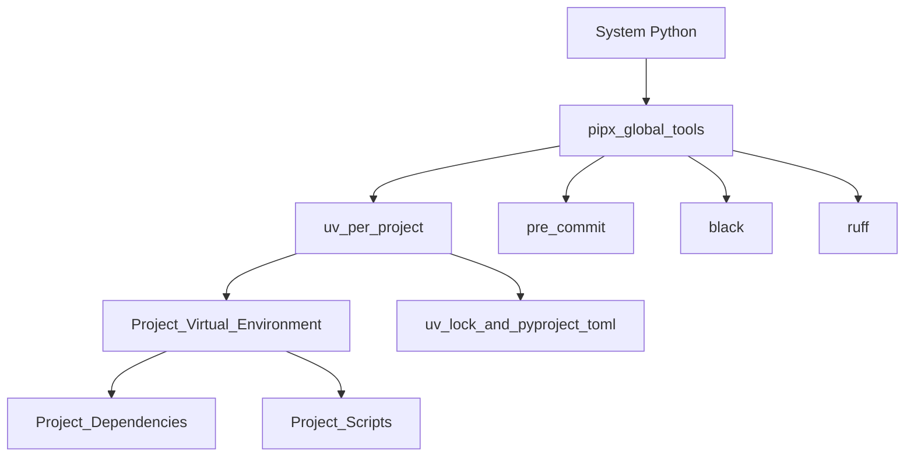

## Technical Documentation - Environment setup with `pipx` and `uv`
This document provides a deeper look at the setup process for the Python environment in this project, expanding on the steps in the README and explaining the reasoning behind each choice.

### Visual Overview

### Python Environment Structure

To keep our systems clean and avoid dependency conflicts, we use a layered approach. The system Python installation is left untouched, while global command-line tools are installed in isolation using `pipx`. Each project then manages its own dependencies and environment using `uv`, which creates a dedicated virtual environment. This structure is now considered best practice for modern Python development, ensuring that global tools do not interfere with project-specific dependencies.

### What is pipx

`pipx` is a tool for installing global command-line applications such as `uv`, `pre-commit`, `black`, and `ruff`. It creates isolated environments for each tool, preventing conflicts with the system Python and other tools. Tools installed with `pipx` are available globally, but do not interfere with project-specific dependencies. If a tool causes issues after an update, you can easily uninstall and reinstall it using `pipx` to restore a clean setup.

### What is uv

`uv` is a modern tool for managing project dependencies and virtual environments. It streamlines workflows by replacing older tools like `pip`, `pip-tools`, and often `poetry`. With `uv`, you can quickly set up a virtual environment, install all required dependencies, and ensure consistency for all contributors. Installing new packages with `uv add` automatically updates both `pyproject.toml` and `uv.lock`, so everyone uses the same versions.

### How pipx and uv Work Together

### How to use pipx

Use `pipx` only for installing command-line tools, not project dependencies. Avoid installing the same tool with both `pip` and `pipx` to prevent PATH conflicts.  To check which tools are installed, run `pipx list`.

### How to use uv

To set up all the packages your project needs, run `uv sync --all-extras`. This will create the virtual environment and install everything listed in `pyproject.toml` (or `requirements.txt`). If you want to add a new package, use `uv add <package>`. This updates your project files so everyone gets the same versions.

If you change branches or update dependencies, run `uv sync --all-extras` to make sure your environment matches the project, including any optional or developer packages.

Don’t use `pip` to install packages in your project—always use `uv add`. If you use `pip`, `uv` won’t know about those packages, which can cause problems.
