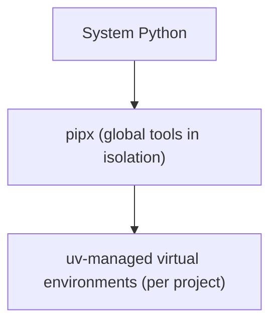
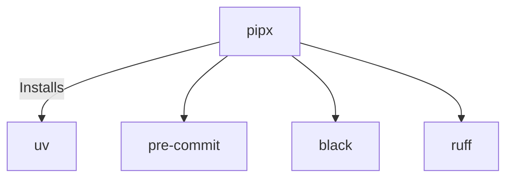
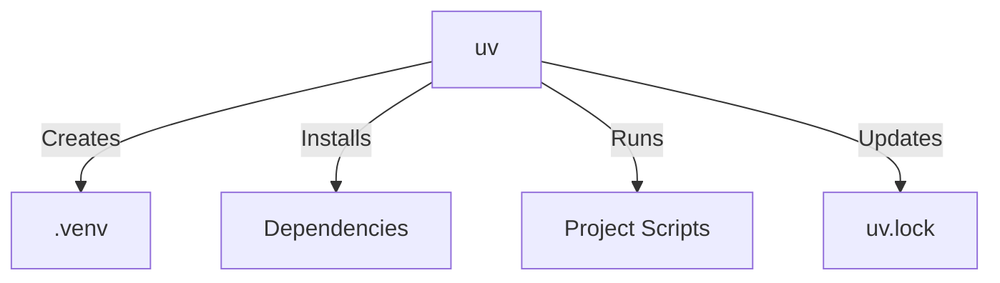
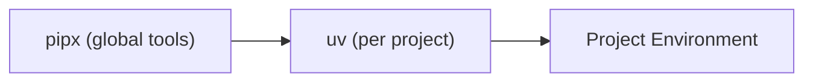
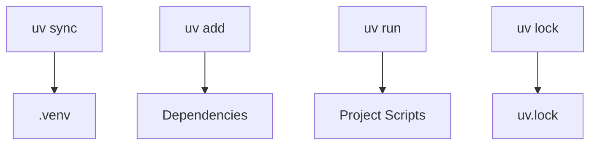

# Deep dive into the technical details of the setup process

**Purpose:** This document provides in-depth technical explanations for the installation steps outlined in the README. It explains the reasoning behind each command and best practice.

---

## 1. The Python Environment Structure

To maintain a clean system and prevent dependency conflicts, the recommended approach uses three layers:



**Why this structure?**
- The system Python remains untouched.
- Global tools are kept separate, preventing interference with project environments.
- Each project is isolated, so dependencies do not clash.

This layered approach is considered the modern standard for Python development.

---

## 2. What  is pipx?



**pipx** is a tool for installing global command-line applications in isolated environments.

**Examples of global tools installed with pipx:**
- uv (package + environment manager)
- pre-commit
- black
- ruff

**Rationale for using pipx:**
- Installing global tools with pip can compromise the system Python.
- Tools may conflict with each other.
- Some tools only function properly inside a virtual environment.
- Upgrading one tool may break another.

**With pipx:**
- Each tool is installed in its own isolated environment.
- Tools do not conflict.
- Tools are accessible from any project.
- The system remains clean and stable.

---

## 3. What is uv?



**uv** is the primary tool used in this project to manage:
- Installing Python packages
- Creating project environments
- Updating dependencies
- Running Python commands consistently

**uv replaces older tools such as:**
- pip
- pip-tools
- poetry (for most uses)
- python -m venv

**Reasons for using uv:**
- uv is significantly faster than pip.
- The commands are easy to use and remember.
- Results are consistent across all developers.
- Environments are handled automatically.
- Commands are cleaner than pip + venv.


## 4. How pipx and uv work together



These tools have distinct roles:

| Tool  | Purpose                                   |
|-------|-------------------------------------------|
| pipx  | Installs uv globally, safely              |
| uv    | Manages the project’s dependencies/env    |

In summary:
- pipx installs tools that are used across multiple projects.
- uv manages the environment within each individual project.

This separation keeps the system clean while ensuring each project has the dependencies it needs.

---

## 5. Best Practices for Using pipx

The following guidelines help avoid common issues:

**Only install command-line tools with pipx**<br>
Command-line tools which are recommended for pipx installation:<br>
- uv
- pre-commit
- ruff
- black

Project dependencies should not be installed with pipx.

**Do not install the same tool with both pip and pipx**
This can cause confusing PATH conflicts.

**After installing a tool with pipx, restart the terminal**
This ensures the PATH is refreshed.

**Check pipx installation health**
```sh
pipx list
pipx reinstall-all
```

**If a tool breaks after an update, reinstall it cleanly:**
```sh
pipx uninstall uv
pipx install uv
```

---

## 6. Best Practices for Using uv



uv simplifies dependency management, but the following habits help keep environments clean:

✅ **Use uv sync as the main install command**
- Creates the environment
- Installs dependencies
- Keeps everything consistent

✅ **Always commit uv.lock**
- Ensures all contributors use the same package versions

**Use uv to run project scripts**
Instead of:
```sh
python script.py
```
use:
```sh
uv run script.py
```
This guarantees the correct environment is used.

**Add packages with uv add**
Example:
```sh
uv add pandas
```
This updates both:
- pyproject.toml
- uv.lock

**Keep dependencies up to date with uv lock and uv sync**
When switching branches or updating dependencies, run:
```sh
uv sync --all-extras

```
uv sync: Installs all dependencies listed in your project's pyproject.toml and requirements.txt files, ensuring your environment matches the project's requirements.
--all-extras ensures optional dependencies defined in the pyproject.toml are also installed.


**Avoid mixing pip and uv inside the project**
If a package is installed with pip, uv will not track it.
Always use:
```sh
uv add ...
```
Instead of
```sh
pip install ...
```
---

**Summary:**
This setup keeps Python development clean, fast, and reliable. By following these practices, common pitfalls are avoided and environments work for all contributors.
